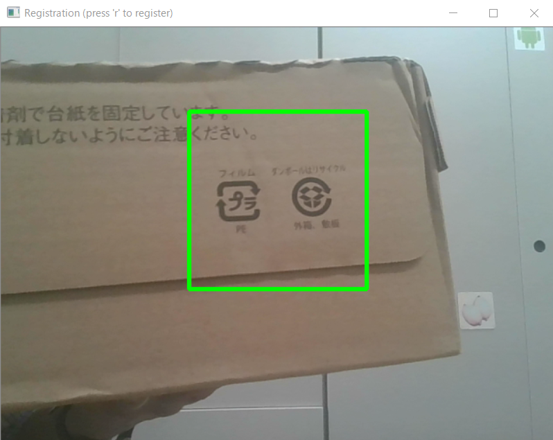
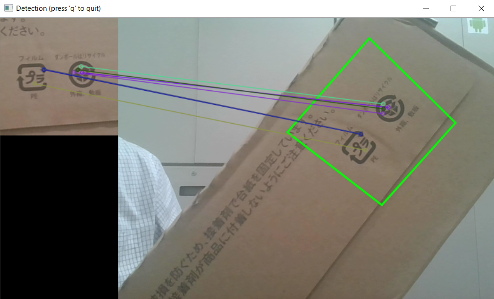

# Feature detection and matching example

This is an example to show how feature point detection can be used to find a registered planar object from video images.

Registration step:


Detection step:


The number of matching is not enough in the above example image, but it may help you find how it works.

## Prerequisite

Python 3.5 and OpenCV 3.

1. Download and install Anaconda3-4.2 (64bit version, python 3.5) from https://repo.continuum.io/archive/. (Note: Not the latest version)
1. Open Anaconda Prompt as administrator.
1. Install OpenCV.
   
   ```
   > conda install -c menpo opencv3 #Should be "menpo" instead of "mempo"
   ```

## How to use

1. Run the example code.

   ```
   > python object_detection.py
   ```

1. Press 'r' to register a query image with a target (textured planar) object. Then object detection will start.
1. Press 'q' to quit the detection.

Tips: Use high-contrast (e.g., black and white) textured planar object.

## Bug

Error check is not enough and the program may be terminated at for example `perspectiveTransform` in some cases.

